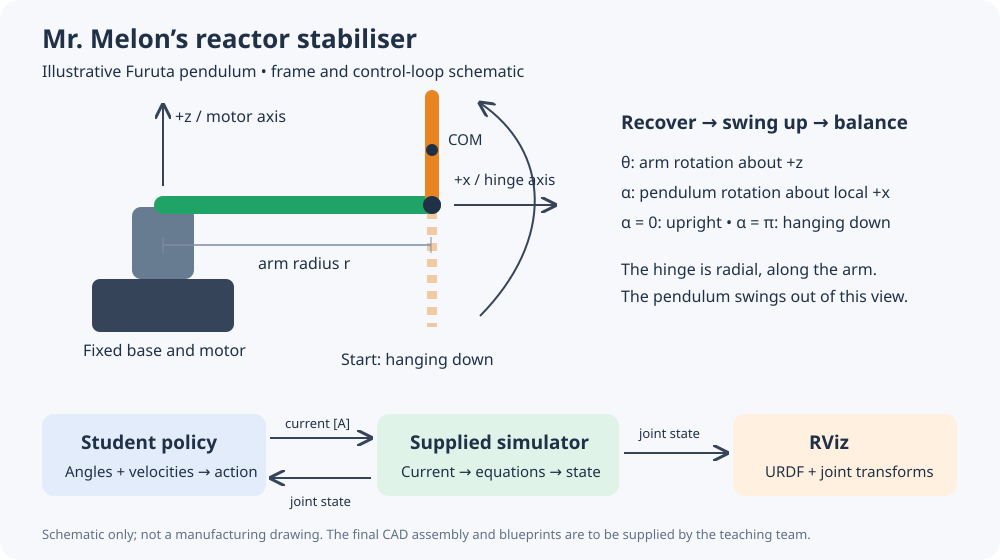

# Mr. Melon’s Warpdrive
## Rebuild the model, learn the controller, reconnect the reactor

Mr. Melon is a famous and extremely wealthy spaceship builder. Unfortunately, a recent data
crash has corrupted his company’s systems. Parts of the ship models, reactor controllers and
communication software have disappeared. Before his next ship can leave the hangar, someone
must reconstruct the missing components of its warpdrive. That someone is you.

The reactor’s stabiliser is a **Furuta pendulum**: a motor turns a horizontal arm, and a pendulum
swings freely about a joint at the arm’s tip. To restart the reactor, the controller must swing
the pendulum up from its resting position and keep it upright.

Your mission has three parts: rebuild the missing pendulum from its blueprint, teach a controller
with reinforcement learning, and connect that controller to the ROS 2 simulator.

## What you receive

- A dimensioned drawing of the pendulum (`pendulum.pdf`) and its material: **titanium,
  density 4500 kg/m³**.
- The ROS 2 package `melon_warpdrive`, containing:
  - the equations of motion, a numerical integrator and a Gymnasium environment (`warpdrive/`);
  - a parameter file with the arm, motor and timing values already filled in
    (`config/reactor_params.yaml`);
  - a ready-made training script (`warpdrive/train.py`) and a common evaluation script
    (`warpdrive/evaluate.py`), so everyone measures the same task;
  - a ROS 2 simulator node, URDF with base and arm meshes, RViz configuration and launch file;
  - skeletons for the parts you write: the reward (`warpdrive/task.py`) and the policy node
    (`warpdrive/policy_node.py`).
- `docs/DYNAMICS.md`: frame conventions, equations and CAD unit conversions.

Setup and all commands are in `README.md`. Use any CAD software that reports mass properties
and exports STEP and STL. The simulator assumes ideal current control and freely rotating joints;
there are no cable limits, collisions, gear backlash or electrical transients.

## 1. Recover the missing pendulum — 25 points

The reactor’s pendulum model is corrupted; only its blueprint survived. Rebuild the part from
`pendulum.pdf`, assign the specified material and extract its mass properties.

### 1.1 CAD model and mass properties

Model the part in the drawing’s coordinate frame. The drawing’s X and Z axes are the
pendulum-local axes used by the simulator:

- local **x** is the hinge axis (it points radially along the arm);
- local **z** points from the pivot towards the centre of mass when the pendulum is upright.

The pendulum rotates about the centre of one of its end bores; that bore is the pivot. Enter these
values into `config/reactor_params.yaml`, replacing the `null` entries:

| Quantity | YAML field | Units and reference |
|---|---|---|
| Pendulum mass | `pendulum_mass` | kg; complete rigid pendulum body |
| Pendulum COM distance | `pendulum_com` | m; pivot to COM along local +z |
| Pendulum COM inertia | `pendulum_ixx`, `pendulum_iyy`, `pendulum_izz` | kg·m²; about local axes **through the COM** |

The arm values (`arm_length`, `arm_inertia`) are supplied. Keep all other values in the file
unchanged; they describe the motor, damping and timing and cannot be obtained from CAD.

The supplied equations already shift the pendulum inertia from its COM to the pivot. **Do not
apply the parallel-axis shift yourself.** Check which physical axis each CAD-reported moment
belongs to; do not copy principal moments without checking. Convert all values to SI units
(see `docs/DYNAMICS.md`).

### 1.2 Visual model

Export the pendulum as STL **in millimetres** to `urdf/model/pendulum.stl`. In
`urdf/reactor.urdf`, set the `<origin>` of the pendulum’s `<visual>` so that the link origin
lies on the pivot and the pendulum points along +z at α = 0. Rebuild the workspace after adding
the STL.

**Checkpoint:** the parameter file loads without errors. With the simulator running and no
controller, RViz shows the pendulum hanging from the tip of the arm and rotating about its pivot.

## 2. Restore the reactor controller — 45 points

The pendulum starts hanging down. A working controller must first pump energy into the system to
swing it up, then slow it down and balance it upright. Implement this as **one learned policy**,
trained with Soft Actor-Critic (SAC) from Stable-Baselines3.

The state is $x=[\theta,\alpha,\dot\theta,\dot\alpha]$, with $\alpha=0$ upright and
$\alpha=\pi$ hanging down. Positive arm rotation is about +z; positive pendulum rotation is about
the arm-local +x axis. The model has the form

$$
M(q)\ddot q+h(q,\dot q)+g(q)+B\dot q=\begin{bmatrix}\tau\\0\end{bmatrix},
\qquad \tau=K_\tau\,i .
$$

The full expressions are in `docs/DYNAMICS.md`; deriving them is not required.

### Task interface

- Observation: $[\sin\theta,\cos\theta,\sin\alpha,\cos\alpha,\dot\theta/10,\dot\alpha/10]$.
- Action: one number $a\in[-1,1]$.
- Commanded current: $i=a\,i_{\max}$ amperes, with $i_{\max}$ = `current_limit`.
- Control interval: 0.01 s, with five RK4 physics substeps per action.
- Episode: `episode_seconds` long, starting near the hanging-down position.
- Swinging through the downward position does **not** end an episode.
- Exceeding the arm or pendulum speed limit **terminates** the episode with a reward of −10.
  Reaching the time limit **truncates** it.

“Balanced” means the pendulum is within 10° of upright, the arm turns slower than 2 rad/s and the
pendulum slower than 1 rad/s. The function `upright(state)` in `warpdrive/task.py` implements this
test.

### 2.1 Design the reward

Implement `reward(state, normalized_action)` in `warpdrive/task.py`. It is called after every step
that did not end in a speed-limit failure, and must return a float. A good reward guides the agent
through both phases: it should make progress towards upright worthwhile, reward slow, stable
balancing and discourage unnecessary effort.

Keep the size of your reward in mind. If the rewards collected over a full episode often add up to
less than −10, ending the episode early by exceeding a speed limit becomes the agent’s best
strategy.

### 2.2 Train and evaluate

1. Explain the observation, action and your reward in your own words.
2. Train with the supplied script (SAC, two hidden layers of 64 units, 200,000 steps). Record the
   seed. The script saves the policy, the exact parameter file used and a record of the settings in
   `runs/policy/`.
3. Evaluate the policy with `python -m warpdrive.evaluate`, using 20 episodes and the default
   evaluation seeds. Evaluate the zero-current baseline as well.
4. Plot the first evaluation episode: pendulum angle (wrapped around upright), both angular
   velocities and current against time (`tools/plot_trace.py`).
5. Make one deliberate change, for example a reward term, the training duration or a
   hyperparameter. Retrain, re-evaluate and compare the measured outcome. A training run
   finishing is not proof of success.

**Success criterion:** during the final three seconds of an episode, the pendulum is balanced at
every control sample. The target is success in at least 18 of 20 evaluation episodes. The time
before that is available for swing-up and settling. Do not tune on the evaluation seeds.

## 3. Reconnect the reactor through ROS 2 — 30 points

The simulator and visualisation already work. Your task is to restore the missing policy node.
Complete `warpdrive/policy_node.py` so that every incoming joint-state message produces a current
command from your trained policy. Learning stays offline; the node only runs the trained policy.

| Interface | Type | Meaning |
|---|---|---|
| `/joint_states` | `sensor_msgs/msg/JointState` | `arm_joint`, `pendulum_joint`; position in rad, velocity in rad/s |
| `/reactor/current_cmd` | `std_msgs/msg/Float64` | motor current in A, **not** the normalized action |
| `/reactor/reset` | `std_srvs/srv/Trigger` | reset near the hanging-down position |

Requirements:

- Declare the node parameters `model_file` and `parameters_file`, and load the policy and the
  parameter file saved by your training run.
- Choose a suitable QoS for the publisher and the subscription and justify it.
- Look up the joints by name; do not rely on the order in the message.
- Give the policy exactly the input it saw during training, and use deterministic inference.
- Convert the action to amperes and publish it.
- Publish zero current if a message is incomplete or contains non-finite values.

The simulator holds the last command for at most 100 ms; after that it applies zero current.

Launch the simulator and RViz, then start your node with `ros2 run melon_warpdrive controller`.
Use the same saved parameter file for both. Reset the reactor and observe swing-up followed by
balancing. RViz only displays the joint motion; the physics come from the supplied equations, not
from the URDF.

**Checkpoint:** demonstrate the loop in RViz, name the direction of each topic, and show that the
published command is a current in amperes. Include a short screen recording or demonstrate live.

## Submission

Submit one archive containing:

1. The native CAD part, STEP and STL exports, a mass-property screenshot showing material, mass,
   COM and the reference frame, your completed `config/reactor_params.yaml` and `urdf/reactor.urdf`.
2. Your `warpdrive/task.py` and `warpdrive/policy_node.py`.
3. The `runs/policy/` folder of your final run (policy, `parameters.yaml`, `contract.json`),
   stating which checkpoint you deployed (`policy.zip` or `best_model.zip`), and your dependency
   versions (`python -m pip freeze`).
4. The evaluation outputs (`metrics.json`, `trajectory.csv`) of your policy and of the
   zero-current baseline, your trajectory plots and the ROS recording.
5. A report of at most three pages: CAD assumptions, reward design and RL choices, your training
   comparison, measured success rate and an explanation of the ROS loop.

Marking: CAD geometry and parameter extraction 25; reward, training, evaluation and explanation
45; ROS integration and demonstration 30. A clear diagnosis of an unsuccessful policy earns method
and analysis credit.
