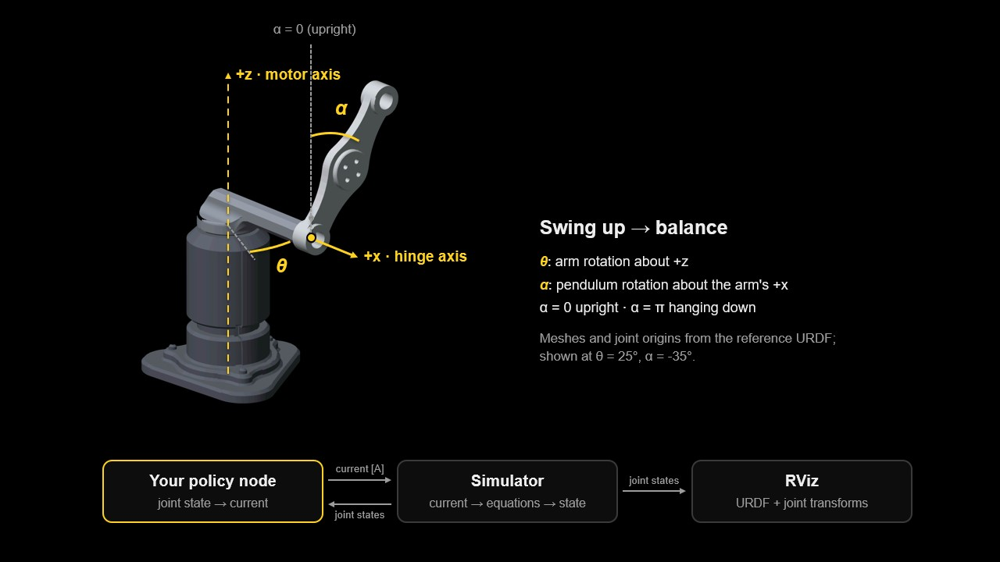
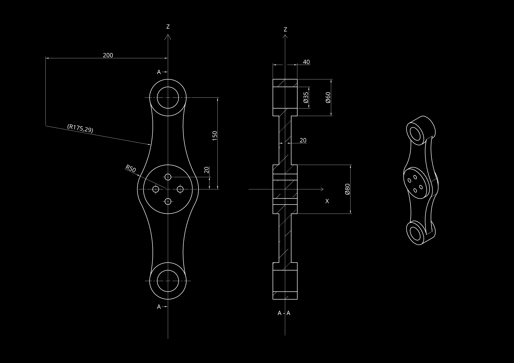
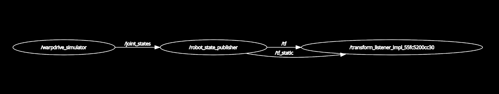
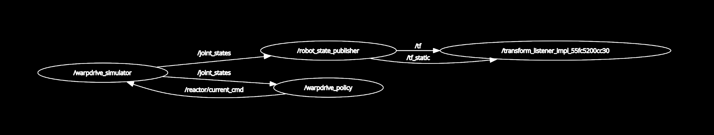

# Mr. Melon's Warpdrive
## Rebuild the model, learn the controller, reconnect the reactor

Real World Robotics · HS 2026 · Prof. Dr. Robert Katzschmann · TA: Max Firkowski

Mr. Melon is a famous and extremely wealthy spaceship builder. A recent cyberattack has corrupted his company's systems: parts of the ship models, reactor controllers and communication software have disappeared. Before his next ship can leave the hangar, someone must reconstruct the missing components of its warpdrive. That someone is you.

All code for the assignment is in this repository, [github.com/firkowski/mr-melons-warpdrive](https://github.com/firkowski/mr-melons-warpdrive).

- **Part 1 · CAD:** 25 points
- **Part 2 · ROS 2:** 30 points
- **Part 3 · RL:** 45 points

The reactor's stabiliser is a **Furuta pendulum**: a motor turns a horizontal arm, and a pendulum swings freely about a joint at the arm's tip. To restart the reactor, the controller must swing the pendulum up from its resting position and keep it upright.

In this assignment you combine three skills you will need throughout the course and in your project: you reconstruct a part in CAD and extract the physical properties a simulator needs, connect a controller to a simulated robot through ROS 2, and train that controller with reinforcement learning.



*Frames and angles (top) and the closed loop you will build (bottom): the policy receives joint states and commands a motor current, the simulator integrates the equations of motion, RViz shows the joint motion.*

### The three parts

1. **Recover the missing pendulum**: rebuild it in CAD from its blueprint and extract its mass properties.
2. **Reconnect the reactor through ROS 2**: complete the node that runs a policy in the ROS 2 loop, and test it with a dummy policy.
3. **Restore the reactor controller**: design a reward, train one policy for swing-up and balancing, evaluate it and demonstrate it in ROS 2.

The ROS 2 part comes before training on purpose: with a working node you can watch every policy you train in RViz, and problems in your node are not mistaken for problems in your policy.

### What you edit

| File                         | What to do                                                                                                | Part |
| ---------------------------- | --------------------------------------------------------------------------------------------------------- | ---- |
| `config/reactor_params.yaml` | Replace the `null` pendulum values with your CAD results                                                  | 1    |
| `urdf/model/pendulum.stl`    | Your exported pendulum mesh, in mm                                                                        | 1    |
| `urdf/reactor.urdf`          | Set the pendulum's visual `<origin>` (marked TODO)                                                        | 1    |
| `warpdrive/policy_node.py`   | Complete the ROS 2 policy node (marked TODO)                                                              | 2    |
| `warpdrive/task.py`          | Implement `reward()`. You are free to create helper functions in `warpdrive/task.py` or in separate files | 3    |

Everything else is supplied: the equations of motion, a Gymnasium environment, the training and evaluation scripts, the ROS 2 simulator, URDF, RViz configuration and launch file. Do not change the physics, the environment, the simulator or the evaluator.

## Setup

Follow `README.md` to install ROS 2 Humble with RoboStack (macOS, Windows or Ubuntu), build the
workspace, set up each new terminal and check the installation. The assignment website shows the same steps with commands
for each system.

## Part 1: Recover the missing pendulum (25 points)

The reactor's pendulum model is corrupted; only its blueprint survived. Rebuild the part from the blueprint, assign the specified material, extract its mass properties for the simulator and add it to the visual robot model.

We recommend [OnShape](https://www.onshape.com/en/), a CAD platform that runs in your browser and needs no installation. The TAs can only support OnShape and Fusion 360; other software that reports mass properties and exports STL is fine, but you will need to solve its issues yourself.



*Blueprint of the pendulum, dimensions in mm (also in `docs/pendulum.pdf`). Material: **titanium, 4500 kg/m³**.*

### Coordinate frame and mass properties

Model the part in the drawing's coordinate frame. The drawing's X and Z axes are the pendulum-local axes used by the simulator:

- local **x** is the hinge axis; it points radially along the arm;
- local **z** points from the pivot towards the centre of mass (COM) when the pendulum is upright.

The pendulum rotates about the centre of one of its end bores; that bore is the pivot.

> **Task 1.1 - CAD model**
>
> 1. Create a new document called `Pendulum` and model the part from the drawing: sketch a profile, then add or remove material with extrusions. Keep the drawing's axes aligned with the CAD axes.
> 2. Assign the material: titanium, 4500 kg/m³.

> **Task 1.2 - Mass properties**
>
> 1. Open the mass properties of the part (OnShape: *Mass properties* tool in the Part Studio). Read the mass, the COM position and the inertia tensor **about the COM**, in the drawing's axes.
> 2. Enter the values below into `config/reactor_params.yaml`, replacing the `null` entries. Keep all other values unchanged.
> 3. Check that the file loads:
>
> ```
> python -c "from warpdrive.model import load_parameters; print(load_parameters('config/reactor_params.yaml'))"
> ```
>
> In the CAD software, take a screenshot of the mass properties showing material, mass, COM and the reference frame.

| Quantity | YAML field | Units and reference |
|---|---|---|
| Pendulum mass | `pendulum_mass` | kg; the complete rigid pendulum body |
| Pendulum COM distance | `pendulum_com` | m; pivot to COM along local +z |
| Pendulum COM inertia | `pendulum_ixx`, `pendulum_iyy`, `pendulum_izz` | kg·m²; about the local axes **through the COM** |

> **Hint: Common mistakes**
>
> - The supplied equations already shift the pendulum inertia from its COM to the pivot. **Do not apply the parallel-axis shift yourself.**
> - Check which physical axis each reported moment belongs to; do not copy principal moments without checking.
> - Use SI units: g → kg and mm → m multiply by 10⁻³; kg·mm² → kg·m² multiplies by 10⁻⁶.
> - The arm values (`arm_length`, `arm_inertia`) are supplied. Motor, damping and timing values cannot be obtained from CAD; do not change them.

### Visual model

The simulator only needs the numbers from Task 1.2. RViz, however, draws the robot from a URDF file, which describes its links, joints and meshes. The repository ships a glitched-out placeholder, `urdf/model/pendulum.stl`, so that RViz already shows a pendulum and you can test the ROS loop before your CAD model is finished. Task 1.3 replaces it with your own export. [For more about URDF, see the ROS documentation](https://docs.ros.org/en/humble/Tutorials/Intermediate/URDF/URDF-Main.html).

> **Task 1.3 - Visual model**
>
> 1. Export the part as STL **in millimetres** to `urdf/model/pendulum.stl`.
> 2. In `urdf/reactor.urdf`, set the `<origin>` of the pendulum's `<visual>` element so that the link origin lies on the pivot and the pendulum points along +z at α = 0.
> 3. Rebuild the workspace (see `README.md`, "Build the workspace") so the new STL is installed, then start the simulator and RViz without a controller:
>
> ```
> ros2 launch melon_warpdrive reactor.launch.py "parameters_file:=$PWD/config/reactor_params.yaml"
> ```
>
> The launch file starts several nodes at once; see the [ROS 2 launch documentation](https://docs.ros.org/en/humble/Tutorials/Intermediate/Launch/Launch-Main.html) to learn how launch files work.

> **Checkpoint**
>
> The parameter file loads without errors. With no controller running, RViz shows your pendulum (not the glitched placeholder) hanging from the tip of the arm and rotating about its pivot.

## Part 2: Reconnect the reactor through ROS 2 (30 points)

ROS 2 is a core framework in modern robotics. It lets perception, control, logging and user interfaces run as separate programs that communicate reliably with one another, and it scales from a laptop simulation to multi-sensor, multi-computer systems. Even if you are not new to ROS 2, work through the official beginner tutorials [CLI tools](https://docs.ros.org/en/humble/Tutorials/Beginner-CLI-Tools.html) and [Client libraries](https://docs.ros.org/en/humble/Tutorials/Beginner-Client-Libraries.html) (especially workspaces, packages and publishers/subscribers) before turning to an AI assistant. They are short, and they explain the structure and the common pitfalls. We work with Python, so follow the Python versions.

### ROS 2 in a nutshell

**Why publisher/subscriber?** Robots are made of parts that run at different rates and have distinct jobs: a camera node streaming detections at 30 Hz, a state estimator fusing an IMU at 200 Hz, a controller updating motors at 100 Hz. Each part publishes what it produces and subscribes to what it needs, so the parts stay loosely coupled behind clear interfaces and are easy to test, swap and extend. Here, the same policy node could drive the simulator or, in principle, a real motor driver publishing the same topics.

| Concept                                                                                                                                                  | Meaning                                                                                                                                                                                                 |
| -------------------------------------------------------------------------------------------------------------------------------------------------------- | ------------------------------------------------------------------------------------------------------------------------------------------------------------------------------------------------------- |
| [Node](https://docs.ros.org/en/humble/Tutorials/Beginner-CLI-Tools/Understanding-ROS2-Nodes/Understanding-ROS2-Nodes.html)                               | One program with one job, such as the simulator or your policy.                                                                                                                                         |
| [Topic](https://docs.ros.org/en/humble/Concepts/Basic/About-Topics.html), [message](https://docs.ros.org/en/humble/Concepts/Basic/About-Interfaces.html) | A named channel carrying messages of one type. Nodes publish to and subscribe from topics without knowing about each other.                                                                             |
| [Service](https://docs.ros.org/en/humble/Concepts/Basic/About-Services.html)                                                                             | A request/response call; used here to reset the simulator.                                                                                                                                              |
| [Parameter](https://docs.ros.org/en/humble/Concepts/Basic/About-Parameters.html)                                                                         | Configures a node at start-up without changing its code, such as the path to your policy.                                                                                                               |
| [QoS](https://docs.ros.org/en/humble/Concepts/Intermediate/About-Quality-of-Service-Settings.html#overview)                                              | Quality-of-service settings: how messages are delivered, for example how many old messages are queued when a subscriber cannot keep up.                                                                 |
| Package, workspace                                                                                                                                       | A package groups nodes, launch files and configuration. It lives in the `src/` folder of a workspace, which you build with `colcon build` and activate in every terminal by sourcing `install/setup.*`. |
| `ros2 run`, `ros2 launch`                                                                                                                                | `ros2 run` starts one node; `ros2 launch` starts several nodes with their parameters from a launch file.                                                                                                |

Useful for debugging: `ros2 topic list`, `ros2 topic echo <topic>`, `ros2 topic hz <topic>`, `ros2 node info <node>` and `rqt_graph`, which draws all nodes and topics as a graph.

### The reactor's ROS graph

The launch file starts three nodes: the **simulator**, which integrates the equations of motion every 10 ms and publishes the joint states; **robot_state_publisher**, which turns joint states into the frames of the URDF; and **RViz**, which displays them. Your **policy node** closes the loop.

| Interface | Type | Meaning |
|---|---|---|
| `/joint_states` | `sensor_msgs/msg/JointState` | `arm_joint`, `pendulum_joint`; position in rad, velocity in rad/s |
| `/reactor/current_cmd` | `std_msgs/msg/Float64` | motor current in A, **not** the normalised action |
| `/reactor/reset` | `std_srvs/srv/Trigger` | reset near the hanging-down position |

To display the current ROS graph, run the following in another terminal, set up as described in `README.md` ("Every new terminal"):

```
rqt_graph
```

The graph shows only the nodes that are currently running. With the simulator, robot_state_publisher and RViz launched (Task 1.3), it should look similar to the one below. The right-most node is RViz's transform listener, which receives the frames RViz displays.



*rqt_graph with the simulator, robot_state_publisher and RViz running.*

The simulator holds the last command for at most 100 ms; after that it applies zero current. Learning stays offline: the policy node only runs a trained network.

> **Task 2.1 - Policy node**
>
> Complete `warpdrive/policy_node.py`, following its TODOs, so that every incoming joint-state message produces a current command. Your node must:
>
> 1. declare the node parameters `model_file` and `parameters_file`, and load the policy and the parameter file saved by a training run;
> 2. create the publisher and the subscription with a suitable QoS (Hint: the QoS must match between the subscriber and publisher);
> 3. look up the joints by name instead of relying on their order in the message;
> 4. give the policy exactly the input it saw during training, and use deterministic inference (refer to [Stable Baselines3's SAC documentation](https://stable-baselines3.readthedocs.io/en/master/modules/sac.html) for details);
> 5. convert the policy's action to amperes and publish it;
> 6. publish zero current if a message is incomplete or contains non-finite values.
>
> The node is installed as the executable `controller`. 

### Test the loop with a dummy policy

You do not need a trained controller to test your node. The package includes a safe dummy policy, `runs/dummy/policy.zip`: a policy with the correct input and output sizes. It turns the arm at about 1 rad/s and does not swing the pendulum up, so you can see in RViz that your node's commands reach the simulator. The commands below use your completed parameter file from Part 1. If you have not finished Part 1 yet, you can use the approximate `runs/dummy/reactor_params.yaml` instead; switch to your own values before you train.

> **Task 2.2 - Closed loop with a dummy policy**
>
> Open three terminals, each set up as described in `README.md` ("Every new terminal").
>
> *Terminal 1 · simulator, robot_state_publisher, RViz*
>
> ```
> ros2 launch melon_warpdrive reactor.launch.py "parameters_file:=$PWD/config/reactor_params.yaml"
> ```
>
> *Terminal 2 · your policy node*
>
> ```
> ros2 run melon_warpdrive controller --ros-args -p "model_file:=$PWD/runs/dummy/policy.zip" -p "parameters_file:=$PWD/config/reactor_params.yaml"
> ```
>
> *Terminal 3 · reset the reactor*
>
> ```
> ros2 service call /reactor/reset std_srvs/srv/Trigger "{}"
> ```
>
> *Inspect the commands.* `ros2 topic echo` and `ros2 topic hz` keep running until you stop them with Ctrl+C, so run them one after the other in Terminal 3, or each in its own terminal:
>
> ```
> ros2 topic echo /reactor/current_cmd
> ```
>
> ```
> ros2 topic hz /reactor/current_cmd
> ```
>
> With all nodes running, start `rqt_graph` in another terminal and take a screenshot that clearly shows the nodes and their topics.
>
> With the dummy policy the arm should turn steadily at about 1 rad/s; the pendulum is not swung up. If the arm stays still, your node is not publishing. Keep this setup: from now on you can watch every policy you train by pointing `model_file` and `parameters_file` at its run folder.

With the launch file and your policy node running, `rqt_graph` should look similar to the one below. Compared with the graph from Task 1.3, your node `/warpdrive_policy` now subscribes to `/joint_states` and publishes `/reactor/current_cmd` back to the simulator, closing the loop.



*rqt_graph with the simulator, robot_state_publisher, RViz and your policy node running.*

> **Checkpoint**
>
> Your node runs without errors, publishes a current in amperes within ±`current_limit` for every joint-state message (about 100 Hz), and publishes zero current for a malformed message. You can name the direction of each topic in the loop.

## Part 3: Restore the reactor controller (45 points)

The pendulum starts hanging down. A working controller must first pump energy into the system to swing it up, then slow it down and balance it upright. You implement this as **one learned policy**.

### Reinforcement learning in a nutshell

An **agent** repeatedly observes the state of an **environment**, chooses an **action** and receives a scalar **reward**. The steps from one reset to the end form an **episode**. The agent learns a **policy**, a mapping from observations to actions, that maximises the expected sum of discounted rewards. The reward is the only way you tell the agent what you want, and it learns whatever the reward pays for, including behaviour you did not intend.

The environment is a Gymnasium environment (`warpdrive/env.py`) around the same equations of motion as the ROS 2 simulator. You train with Soft Actor-Critic (SAC) from Stable-Baselines3: an off-policy actor-critic algorithm for continuous actions that learns from a replay buffer of past experience and explores by rewarding randomness in its actions.

### Model and task interface

The state is x = [θ, α, θ̇, α̇], with α = 0 upright and α = π hanging down. Positive arm rotation is about +z; positive pendulum rotation is about the arm-local +x axis. With q = [θ, α], the model has the form below; the full expressions are in `docs/DYNAMICS.md`, and you do not need to derive them.

`M(q)·q̈ + h(q, q̇) + g(q) + B·q̇ = [τ, 0]ᵀ,   τ = Kτ·i`

|                  |                                                                                                              |
| ---------------- | ------------------------------------------------------------------------------------------------------------ |
| Observation      | [sin θ, cos θ, sin α, cos α, θ̇/10, α̇/10]                                                                   |
| Action           | one number a ∈ [−1, 1]                                                                                       |
| Current          | i = a · imax amperes, with imax = `current_limit`                                                            |
| Control interval | 0.01 s, with five RK4 physics substeps per action                                                            |
| Episode          | `episode_seconds` long, starting near the hanging-down position; swinging through the bottom does not end it |
| Termination      | exceeding the arm or pendulum speed limit ends the episode with reward −10; the time limit truncates it      |
| Balanced         | within 10° of upright, arm slower than 2 rad/s, pendulum slower than 1 rad/s (`upright(state)` in `task.py`) |

> **Task 3.1 - Reward function**
>
> Implement `reward(state, normalized_action)` in `warpdrive/task.py`. It is called after every step that did not end in a speed-limit failure and must return a float. A good reward guides the agent through both phases: it makes progress towards upright worthwhile, rewards slow and stable balancing, and discourages unnecessary effort.

> **Hint: Mind the scale of your reward**
>
> If the rewards collected over a full episode often add up to less than −10, ending the episode early by exceeding a speed limit becomes the agent's best strategy. In other words, the agent may learn to spin the pendulum as fast as possible to avoid incurring the negative reward.

> **Task 3.2 - Training**
>
> Train with the supplied script (SAC, two hidden layers of 64 units, 200,000 steps by default) and record the seed:
>
> ```
> python -m warpdrive.train --out runs/policy --seed 7
> ```
>
> To change the number of steps, use the `--steps` option. For example, to stop training after 100,000 steps, run
>
> ```
> python -m warpdrive.train --out runs/policy --seed 7 --steps 100000
> ```
>
> Training takes about 10–20 minutes on a recent laptop (longer in a virtual machine). It writes to `runs/policy/`:
>
> | File | Content |
> |---|---|
> | `policy.zip` | policy at the end of training |
> | `best_model.zip` | best policy found by the periodic evaluation during training |
> | `reactor_params.yaml` | copy of the exact parameters used; use this copy for everything that follows |
> | `contract.json` | observation and action definition, seed, step count |
> | `evaluations.npz`, `training.monitor.csv` | learning curves |
>
> `best_model.zip` and `evaluations.npz` are first written at the periodic evaluation after 10,000 steps. A shorter test run only writes `policy.zip`; use that file in the commands that follow.
>
> Watch the trained policy in RViz with your setup from Task 2.2, pointing `model_file` and `parameters_file` at `runs/policy/`. Use a new `--out` folder for every run you want to keep.

> **Task 3.3 - Evaluation**
>
> Evaluate the policy on 20 episodes with the default evaluation seeds, and evaluate the zero-current baseline:
>
> ```
> python -m warpdrive.evaluate --model runs/policy/best_model.zip --params runs/policy/reactor_params.yaml --out runs/policy/evaluation #trained policy evaluation
> python -m warpdrive.evaluate --params runs/policy/reactor_params.yaml --out runs/zero_current #zero-current baseline evaluation
> ```
>
> Each writes `metrics.json` and the first episode's `trajectory.csv`. Plot pendulum angle (wrapped around upright), both angular velocities and current against time, for the policy and the baseline:
>
> ```
> python tools/plot_trace.py runs/policy/evaluation/trajectory.csv --out runs/policy/evaluation/trajectory.png
> python tools/plot_trace.py runs/zero_current/trajectory.csv --out runs/zero_current/trajectory.png
> ```

> **Checkpoint: Success criterion**
>
> An episode counts as a success if no speed limit was exceeded and the pendulum is balanced (`upright(state)`: within 10° of upright, arm slower than 2 rad/s, pendulum slower than 1 rad/s) at every control sample of the final three seconds. `warpdrive.evaluate` reports this for each episode and as `success_rate` in `metrics.json`. Your policy is successful if it succeeds in most evaluation episodes. This defines "successful" for Tasks 3.4 and 3.5; it is not a grading threshold.

> **Task 3.4 - Demonstration in ROS 2**
>
> Run your final policy with your node from Part 2, using the `runs/policy/reactor_params.yaml` saved by its training run for both the simulator and the node. If the policy is successful (see the success criterion above), reset the reactor and record a video (at most 30 s, `.mp4`) of the swing-up followed by balancing in RViz, with `ros2 topic echo /reactor/current_cmd` visible in a terminal.

> **Task 3.5 - Analyse the reward**
>
> Write a short reward analysis. What it must contain depends on whether your final policy is successful (see the success criterion above).
>
> **If your policy is successful:** explain how each element of your reward function was chosen to achieve the goal. For every term, say which behaviour it is meant to produce or prevent (for example swinging up, slowing down near the top, balancing, saving effort), why it has its weight or scale, and what changed when it was missing or set differently, if you tried that.
>
> **If your policy is not successful:** you can still receive full marks. Analyse **at least three reward designs** you trained (up to three are assessed; feel free to train more). For each design:
>
> - describe how the agent "gamed" the reward: which behaviour it learned that earns a high return without achieving the goal (for example spinning the pendulum through the top, hovering near upright without slowing down, or ending the episode early), and why your reward pays for that behaviour;
> - explain the fix you applied in the next design and whether it worked.
>
> In both cases, support your analysis with data from training: the periodic evaluation in `runs/<run>/evaluations.npz` (keys `timesteps`, `results`, `ep_lengths`), the training log `training.monitor.csv`, your evaluation trajectories and what you saw in RViz. Useful questions:
>
> - What does the return curve represent? What range of values is possible with your reward, and why?
> - How does its shape relate to what the agent learns, for example swing-up first and balancing later?
> - Episodes only end early when a speed limit is exceeded. What does the episode length tell you, and how can you use it to monitor training?

## Submission

Upload one ZIP file named `assignment_[First name]_[Last name].zip` containing:

1. **CAD:** the native CAD part or a view link to your OnShape document, STL export, the mass-property screenshot, your `config/reactor_params.yaml` and `urdf/reactor.urdf`.
2. **Code:** your `warpdrive/task.py`, `warpdrive/policy_node.py`, and files with your helper functions, if applicable.
3. **Policy:** the `runs/policy/` folder of your final run, which checkpoint you deployed (`policy.zip` or `best_model.zip`).
4. **Evaluation:** `metrics.json` and `trajectory.csv` of your policy and of the zero-current baseline, and your plots.
5. **ROS 2:** the `rqt_graph` screenshot and a link to your demonstration video. Make the link viewable by anyone with it, and test it in a private browser window.
6. **Reward Analysis (.txt, .md, .pdf or .docx)**: Your answer to Task 3.5.

| Part | Assessed | Points |
|---|---|---|
| 1 · Pendulum | CAD geometry and parameter extraction | 25 |
| 2 · ROS 2 | policy node and closed-loop demonstration | 30 |
| 3 · Controller | reward, training, evaluation and analysis | 45 |
| **Total** |  | **100** |

Deviations from the "real" dynamics resulting from mistakes in the CAD part do not influence the grading of the other two parts of the assignment, as long as the resulting physics is plausible. Large inaccuracies (e.g. wrong inertia units) may, however, make it impossible to control the pendulum under the servo current constraints. Both the simulator and the training script use your parameter file, so there is no gap between the physics you train on and the physics you deploy on.

## AI & TA policy

*Ask about the system, not the solution*

You may ask the TAs and AI tools anything that helps you **understand the system**: the concepts, the tools, the supplied code and the errors you run into. You may not ask them for **the solution**: answers that decide or produce what a task asks you to deliver.

| Allowed: questions about the system | Not allowed: questions about the solution |
|---|---|
| "What is a ROS node?" | "What is a good reward function for this task?" |
| "What is the difference between a state and an observation?" | "Write the code for this node." |
| "Why do we normalize the policy input?" | "What should I put in the URDF, and where?" |
| "Why is this error happening?" |  |

> **Hint: Rule of thumb**
>
> If the answer explains how something works, ask. If the answer could go into your submission more or less as it is (code, a reward function, URDF content, parameter values), it is a solution: work it out yourself.

## Helpful notes

- Activate `ros_env` and source the workspace in every new terminal (see `README.md`, "Every new terminal").
- Use the same saved parameter file (the `reactor_params.yaml` copy in your `runs/...` folder) for evaluation, the simulator and the policy node.
- Work incrementally: parameter file loads → pendulum looks right in RViz → your node publishes → it publishes the right values → train.

See the troubleshooting table in `README.md` for common errors and their fixes.

**Mindset.** Robotics is as much about integration as about algorithms. Expect small hurdles: a wrong path, forgetting to source, a unit off by a factor of 1000. Solving them is part of the skill you are building. Share quick questions and fixes with your classmates, and if you hit a wall after debugging, reach out to the TA. The goal is not only to make the pendulum stand up, but to build a small system you can understand, explain and change in minutes.
